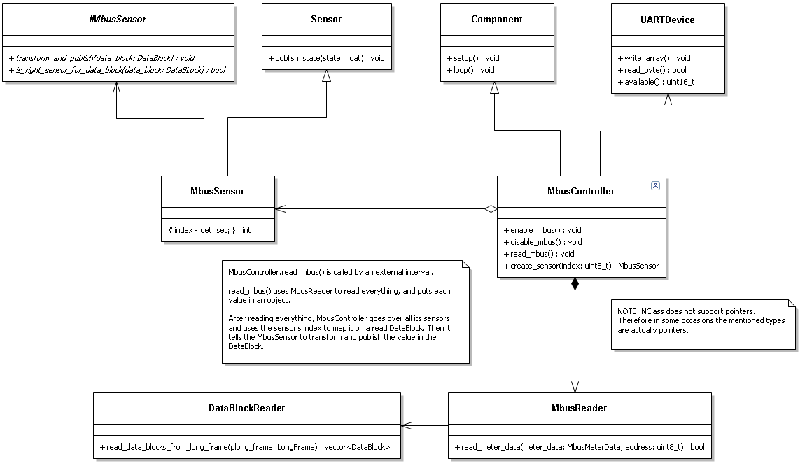
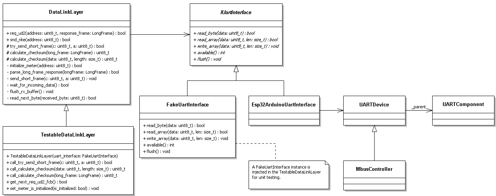

# mbus-esphome

## What is this all about?

This repository contains an integration for an Mbus meter in ESPHome.
It allows a user to configure the mbus_controller component in /components as an external component.

## How to use it

### Hardware

First of all, some hardware is required. I have designed a PCB that needs to be powered using a micro USB B connector.  
One Mbus meter can be connected to the board using a detachable screw terminal (one part of the connector sits on the PCB, the meter wires are fastened with screws in the other part). An ESP32 WROVER module is part of the PCB, which takes care of the ESPHome integration.

Currently the PCB is not perfect and has an issue that I am currently working on.

I have a few of these boards available, and can produce more on demand for a fair price.

### Software

This repository contains the mbus_controller component. It requires the meter address, and of course sensors need to be defined in the YAML.

The Mbus protocol does not tell you the exact semantics of the values it returns. E.g.: if it returns two temperatures (temperature of out-flow, and temperature of in-flow) it merely indicates that both values are temperatures with a certain unit and multiplier, but not which one is the in-flow or the out-flow. The integration assumes that the meter consistently returns its sensor values in the same order. That is why the sensor configuration requires an index to map it to a returned value.

My experience with this is limited to a single type of meter so far: the Kamstrup heat meter, type 303WA02DB. If other meters behave differently, changes are required (but I highly doubt this will be the case).

### Example YAML

This YAML is not complete. It also requires things like ota, wifi, api etc.  
It is merely intended to show the parts relevant for this integration.
```
esp32: 
  board: esp32dev
  framework:
    type: arduino

external_components:
  - source:
      type: git
      url: https://github.com/pdjong/mbus-esphome
      ref: main

uart:
  baud_rate: 2400
  tx_pin: 19
  rx_pin: 18
  data_bits: 8
  parity: EVEN
  stop_bits: 1

switch:
  - platform: template
    name: MbusSwitch
    optimistic: true
    restore_mode: RESTORE_DEFAULT_OFF
    id: readmbus
    turn_on_action:
    - lambda: |-
        id(mbuscontroller).enable_mbus();
    turn_off_action:
    - lambda: |-
        id(mbuscontroller).disable_mbus();

button:
  - platform: restart
    name: "${friendly_name} Restart"
  - platform: factory_reset
    name: "${friendly_name} Factory Reset"    

interval:
  - interval: 8sec
    then:
      - lambda: |-
            id(mbuscontroller).read_mbus();

mbus_controller:
  id: mbuscontroller
  address: 0x01

sensor:
  - platform: mbus_controller
    name: "${friendly_name} T1"
    index: 6
    accuracy_decimals: 2
    unit_of_measurement: "°C"
    device_class: "temperature"
    icon: "mdi:thermometer"
  - platform: mbus_controller
    name: "${friendly_name} T2"
    index: 7
    accuracy_decimals: 2
    unit_of_measurement: "°C"
    device_class: "temperature"
    icon: "mdi:thermometer"
  - platform: mbus_controller
    name: "${friendly_name} Flow"
    index: 11
    accuracy_decimals: 0
    unit_of_measurement: "l/h"
    icon: "mdi:water"
    filters:
      - multiply: 0.001
```

As you can see, one of the sensors has a filter to divide by 1000.
This is done because the meter returns the value in cubic meters per hour, and that is what the raw sensor value will be in. But a more friendly unit in this case is liters per hour.

NOTE: lifespan of Mbus meter communication modules are said to be severely reduced if they are read out much more than anticipated. That is why the example YAML contains a button to disable the read out. This can be used for instance to read out a meter at a high interval when the system in which the meter is placed, is active, and stop the read out when the system is inactive.

#### How to find the data blocks that are returned

- The manual of the meter would be a good starting place.  
- Probably the meter can display the order in which it returns the values.
- After the first successful meter read-out after enabling the MbusSwitch, the component will log some information on the data blocks that the meter returned. See for example [kamstrup_data_blocks.txt](https://github.com/pdjong/mbus-esphome/blob/main/kamstrup_data_blocks.txt). This will help in identifying which data block should accompany a sensor.

## Mbus

Mbus, short for Meter-Bus, is a protocol to read out meters like water, gas and electricity meters.
Originally it was meant for remote reading of these utility meters in homes.
For practical (and obvious) reasons the physical setup is a bus system. The bus has no Chip Select kind of wire, so each meter has an address.

### Mbus - physical

Bit of basics on the physical protocol: The bus wires have 36V across them. When the controller wants to send a byte to a meter, it indicates it wants to start transmitting by decreasing the voltage across the bus lines by 12V. Then it can switch between -12V or the original voltage to indicate a '0' or a '1'. The meter sends data back to the controller in a completely different way: it increases the current drawn on the bus by 11 to 20 milli Ampères.

Because of the (somewhat) higher voltage on the bus: be careful with it.

### Mbus - protocol

The Mbus protocol is built on top of the OSI model. It mainly implements the Physical, Data link and Application layers. It also supports the Network layer, but this is NOT supported by this integration.

The Data link layer has multiple features like retries in case of no or incorrect responses.
It allows the Application layer to request so-called user data, which is just binary data to the Data link layer, and is interpreted in the Application layer.

The Application layer in the integration only supports a generic read out of the meter.
While the Mbus protocol supports much more, this is the basis that is required for the integration.

Meter data is sent in so-called data blocks. Each data block contains meta data about the value it contains. The data block indicates the size of the actual data, and its data type (e.g. 16-bit binary integer). Next to that it contains information on the semantics of the data. E.g. whether the value is an instantaneous value or some maximum or minimum value, whether the value is the most recent one or an older value. Even more important: it contains the type of physical quantity (e.g. energy, volume, volume flow, etc.) with the unit (e.g. Wh or J, m3, m3/h or m3/min or m3/s) and the power of ten with which the raw value has to be multiplied (e.g.: a volume with unit m3, and ten-power -3, is in 0.001 cubic meters, which is liters).

See [Meter-Bus on Wikipedia](https://en.wikipedia.org/wiki/Meter-Bus), and for much more in-depth information see [m-bus.com](https://m-bus.com/).

## What is supported, and what not

First of all, this information is not complete.  
When the text below mentions a bit, it is zero-based (e.g.: bit 1 is the 2nd bit).

### Assumptions

- Mode is 1: data is transfered Least Significant Byte first for multi byte records.  
This means that bit 2 of the CI field is expected to be 0.
- There are no manufacturer specific data structures at the end of the user data
- Baud rate is fixed at 2400

### Unsupported Mbus features

- Selecting specific fields for readout. Only the standard telegram can be read out.
- Multi-telegram user data messages. In case the last data block indicates more follows in a next telegram, the Application layer should request another user data telegram from the Data link layer. This is NOT supported currently.
- Actions (see paragraph 6.5 on [m-bus.com - Application Layer](https://m-bus.com/documentation-wired/06-application-layer))
- ACD / DFC bits in Data link layer
- Fixed data structure
- Sub-unit of device in DIF extension

### Supported DIF Data Field values

- 2: 16 bit integer
- 4: 32 bit integer

Other values need to be implemented in the relevant IMbusSensor class, and the Data link layer.

### Supported VIF

Supported VIF types:
- Primary VIF (VIF extension bits are skipped / ignored)
- Manufacturer specific (VIF extension bits are skipped / ignored)

Supported primary VIFs:
- Energy
- Volume
- On Time / Operating Time
- Power
- Volume Flow
- Flow Temperature
- Return Temperature
- Temperature Difference
- External Temperature
- Time Point, only date, data type G

## Structure of this repository

This repository is a PlatformIO project to allow unit testing of part of the code.  
Normally a PlatformIO project can be built and it will result in a binary. This is NOT the intention of this project!  

I highly recommend the PlatformIO extension for VSCode to run unit tests.
  
Below follows the structure of this repository:

    mbus-esphome
    ├── components
    │   ├── mbus_controller
    │   │   ├── __init__.py
    │   │   ├── sensor.py
    │   │   ├── mbus_controller.cpp
    │   │   ├── mbus_controller.h
    │   │   ├── ... (code files)
    │   ├── test_includes
    │   │   ├── _stdint.h
    |   │   └── test_includes.h
    |   └── README
    ├── spice_model
    │   └── mbus-spice-model.asc (LTSpice model)
    ├── src
    │   └── main.cpp
    ├── test
    │   ├── test_application_layer
    │   │   ├── test_application_layer.cpp
    │   │   └── testable_mbus_reader.h
    │   ├── test_data_link_layer
    │   │   ├── test_data_link_layer.cpp
    │   │   └── testable_data_link_layer.h
    │   └── README
    ├── .gitignore
    ├── design.ncp
    ├── kamstrup_data_blocks.txt
    ├── platformio.ini
    ├── README.md
    └── example.yaml

The entire component resides in /components/mbus_controller  
Unit test files are in /test  
Design diagrams are in design.ncp, which can be opened in [NClass](https://nclass.sourceforge.net/)  
An example YAML file can be found in example.yaml

## Unit Testing - What does it look like

Using PlatformIO one can execute the unit tests, with the following results (at moment of writing this):


## Design

### Design Overview

See below diagram (taken from [design.ncp](https://github.com/pdjong/mbus-esphome/blob/main/design.ncp))

MbusController is a Component that starts a FreeRTOS task in which it reads out the meter if required, and passes the read data to its MbusSensors. Those transform the raw binary data to a sensor value and then publish this value.

MbusReader uses its DataLinkLayer to read out the meter's binary data in the form of a Long Frame telegram. It then passes this telegram to the DataBlockReader, which knows how to read the variable data blocks from the binary user data in the telegram.

MbusController needs to know what data block each sensor requires. Therefore the sensors implement an interface that provides a way for the MbusController to see if a given data block fits the sensor.



### IUartInterface

The DataLinkLayer does not directly use the UARTDevice, but uses an interface instead. This is to enable unit testing of the DataLinkLayer and MbusReader classes.

Unit test code instantiates FakeUartInterface and passes that to the code under test (MbusReader or DataLinkLayer).  
The MbusController code instantiates Esp32ArduinoUartInterface while passing itself as a UARTDevice, and passes that to the MbusReader.

That way the Esp32ArduinoUartInterface actually uses the real hardware, while the FakeUartInterface does not.

